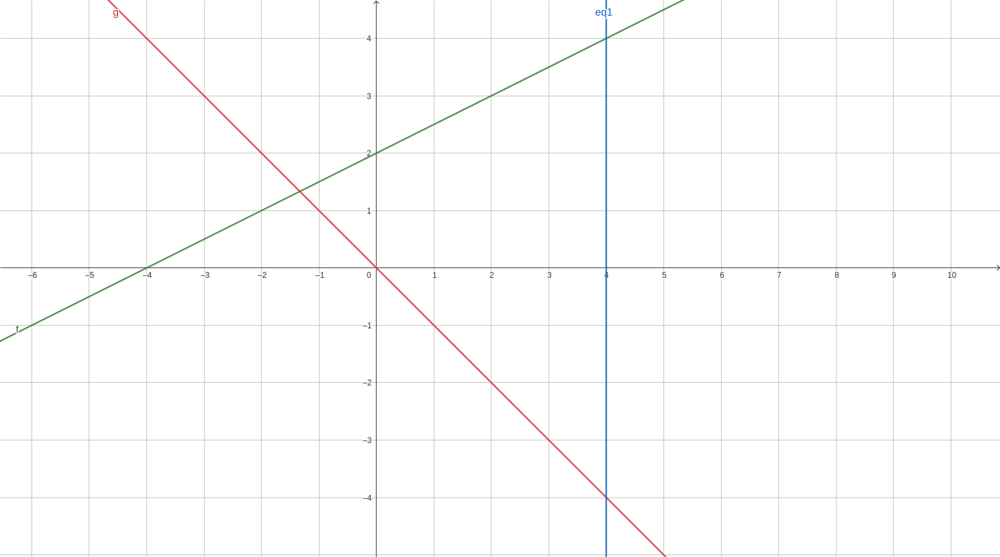

1. Compute the following double integral
	* $\int\int_{\Omega}\frac{1}{1+x+y}dxdy$, $\Omega: [0,1]\times[0,2]$. (Hint: it requires integration by part for $\int\ln(x)dx$.)
	* $\int\int_{\Omega}\frac{xy}{(x^2+y^2)^2}dxdy$, $\Omega:[1,2]\times[1,3]$. (Hint: we are going to apply integration by part twice.)
2. Explain $\int\int_{\Omega}1dxdy$ is the area of $\Omega$.
3. Examine the region $\Omega$ bounded by the lines $x=4$, $y=\frac{1}{2}x+2$, and $y=-x$, as depicted in the figure below. Find the limits of $x$ and $y$ for $\Omega$.
4. Consider the region $\Omega$ defined by $0 < x < 2$ and $0 < y < x^2$. Rewrite the inequality so that instead of bounding $x$ by constants and bounding $y$ by functions, we will bound $y$ by constants and $x$ by functions.

## ChatGPT Answer checking(beta)

* API Key: You can get your key by following the following steps [link](https://mrtang.tw/blog/post/how-to-apply-for-a-chatgpt-api-key)
<input type="text" id="api-key" name="api-key">

1. 
	* Your answer of 1-1: <input type="text" id="answer-2022-3-3-1" name='2022-3-3-1'><button onclick="gpt('2022-3-3-1')">Submit</button>
		
[correct/incorrect]

	* Your answer of 1-2: <input type="text" id="answer-2022-3-3-2" name='2022-3-3-2'><button onclick="gpt('2022-3-3-2')">Submit</button>
		
[correct/incorrect]

2. Your answer of 2: <input type="text" id="answer-2022-3-3-3" name='2022-3-3-3'><button onclick="gpt('2022-3-3-3')">Submit</button>
	
[correct/incorrect]

3. Your answer of 3: <input type="text" id="answer-2022-3-3-4" name='2022-3-3-4'><button onclick="gpt('2022-3-3-4')">Submit</button>
	
[correct/incorrect]

4. Your answer of 4: <input type="text" id="answer-2022-3-3-5" name='2022-3-3-5'><button onclick="gpt('2022-3-3-5')">Submit</button>

	
[correct/incorrect]
