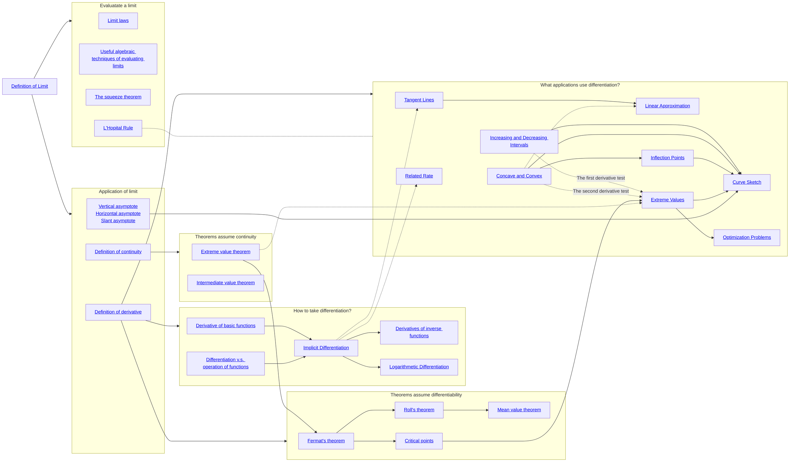

Right now, I only finished Asymptote. Other materials will be upload soon or later.

```mermaid
%%{init: {"flowchart":{"useMaxWidth": 0}}}%%
flowchart LR;
    Limit[<a href='../books/calculus/1-definition-of-limits'>Definition of Limit</a>];
    LimitLaw[<a href='../books/calculus/1-1-how-to-evaluate-limits#limit-laws'>Limit laws</a>];
    LimitTech[<a href='../books/calculus/1-1-how-to-evaluate-limits#algebraic-tricks'>Useful algebraic techniques of evaluating limits</a>];
    Squeeze[<a href='../books/calculus/1-1-how-to-evaluate-limits#the-squeeze-theorem'>The squeeze theorem</a>];
    LHopital[<a href='../books/calculus/1-1-how-to-evaluate-limits#lhpitals-rule'>L'Hopital Rule</a>];
    Asymptote[<a href='../books/calculus/1-2-asymptotes'>Vertical asymptote
    Horizontal asymptote
    Slant asymptote</a>];
    Continuity[<a href='../books/calculus/2-definition-of-continuity'>Definition of continuity</a>];
    EVT[<a href='../books/calculus/2-1-theorems-assuming-continuity#extreme-value-theorem'>Extreme value theorem</a>];
    IVT[<a href='../books/calculus/2-1-theorems-assuming-continuity#intermediate-value-theorem'>Intermediate value theorem</a>];
    Diff[<a href='../books/calculus/3-definition-of-derivatives'>Definition of derivative</a>];
    BasicFunction[<a href='../books/calculus/3-1-how-to-find-derivatives#derivatives-of-basic-functions'>Derivative of basic functions</a>];
    BasicRules[<a href='../books/calculus/3-1-how-to-find-derivatives#differential-rules'>Differentiation v.s. operation of functions</a>];
    ImplicitDiff[<a href='../books/calculus/3-1-how-to-find-derivatives#implicit-differentiation'>Implicit Differentiation</a>];
    DiffInverse[<a href='../books/calculus/3-1-how-to-find-derivatives#derivatives-of-inverse-functions'>Derivatives of inverse functions</a>];
    LogDiff[<a href='../books/calculus/3-1-how-to-find-derivatives#logarithmetic-differentiation'>Logarithmetic Differentiation</a>];
    Fermat[<a href='../books/calculus/3-2-theorems-assuming-differentiability#fermats-theorem'>Fermat's theorem</a>];
    Roll[<a href='../books/calculus/3-2-theorems-assuming-differentiability#rolls-theorem'>Roll's theorem</a>];
    MVT[<a href='../books/calculus/3-2-theorems-assuming-differentiability#the-mean-value-theorem'>Mean value theorem</a>];
    CriticalPt[<a href='../books/calculus/3-2-theorems-assuming-differentiability#critical-points'>Critical points</a>];
    TangentLine[<a href='../books/calculus/3-3-application-of-differentiation#tangent-lines'>Tangent Lines</a>];
    LinearApprox[<a href='../books/calculus/3-3-application-of-differentiation#linear-approximation'>Linear Approximation</a>];
    RelatedRate[<a href='../books/calculus/3-3-application-of-differentiation#related-rate'>Related Rate</a>];
    CurveSketch[<a href='../books/calculus/3-3-application-of-differentiation#curve-sketch'>Curve Sketch</a>];
    ExtremeValue[<a href='../books/calculus/3-3-application-of-differentiation#extreme-values'>Extreme Values</a>];
    InflectionPt[<a href='../books/calculus/3-3-application-of-differentiation#inflection-points'>Inflection Points</a>];
    Increasing[<a href='../books/calculus/3-3-application-of-differentiation#increasing-and-decreasing-intervals'>Increasing and Decreasing Intervals</a>];
    Concavity[<a href='../books/calculus/3-3-application-of-differentiation#concavity'>Concave and Convex</a>];
    OptimizationProblem[<a href='../books/calculus/3-3-application-of-differentiation#optimization-problems'>Optimization Problems</a>];
    subgraph LimitApplication [Application of limit];
      direction LR;
      Asymptote;
      Continuity;
      Diff;
    end;
    Limit-->LimitApplication;
    subgraph LimitHow [Evaluatate a limit];
      direction LR;
      LimitLaw;
      LimitTech;
      Squeeze;
      LHopital;
    end;
    Limit-->LimitHow;
   
    subgraph ContinuityTheorems [Theorems assume continuity];
      direction TB;
      EVT;
      IVT;
    end;
    Continuity-->ContinuityTheorems;
    subgraph DiffTheorems [Theorems assume differentiability];
      direction BT;
      Fermat-->Roll-->MVT;
      Fermat-->CriticalPt;
    end;
    subgraph DiffHow [How to take differentiation?];
      direction TB;
      BasicFunction & BasicRules-->ImplicitDiff;
      ImplicitDiff-->DiffInverse & LogDiff;
    end;
    Diff-->DiffHow;
    
    subgraph DiffApplication [What applications use differentiation?];
      direction TB;
      TangentLine-->LinearApprox;
      RelatedRate~~~Increasing & Concavity;
      Increasing & Concavity-->CurveSketch;
      InflectionPt & ExtremeValue --> CurveSketch;
      Increasing-.->|The first derivative test|ExtremeValue;
      Concavity-.->|The second derivative test|ExtremeValue;
      Concavity-->InflectionPt
      ExtremeValue-->OptimizationProblem;
      Concavity-.->LinearApprox
    end;
    Diff-->DiffApplication;
    ImplicitDiff-.->TangentLine;
    ImplicitDiff-.->RelatedRate;
    Asymptote-->CurveSketch;
    CriticalPt-->ExtremeValue;
    EVT-.->ExtremeValue;
    Diff-->DiffTheorems;
    EVT-->Fermat;        
    LHopital<-.-DiffApplication;
```