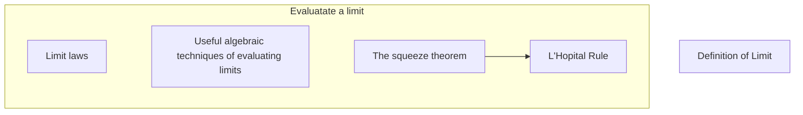

    Limit-->LimitHow;
    subgroup LimitApplication [Application of limit];
      direction LR;
      Asymptote~~~Continuity;
      Continuity~~Diff;
    end;
    Limit-->LimitApplication;
    subgraph ContinuityTheorems [Theorems assume continuity];
      direction LR;
      EVT~~~IVT;
    end;
    Continuity-->ContinuityTheorems;
    subgraph DiffHow [How to take differentiation?];
      direction LR;
      BasicFunction & BasicRules-->ImplicitDiff;
      ImplicitDiff-->DiffInverse & LogDiff;
    end;
    Diff-->DiffHow;
    subgroup DiffApplication [What applications use differentiation?];
      direction LR;
      TangentLine-->LinearApprox;
      RelatedRate~~~Increasing & Concavity;
      Increasing & Concavity-->CurveSketch;
      CriticalPt-->ExtremValue;
      InflectionPt & ExtremeValue --> CurveSketch;
      Increasing-->|The first derivative test|ExtremeValue;
      Concavity-->|The second derivative test|ExtremeValue;
      ExtremeValue-->OptimizationProblem;
    end;
    Diff-->DiffApplication;
    ImplicitDiff-.->TangentLine;
    ImplicitDiff-.->RelatedRate;
    Asymptote-->CurveSketch;
    subgroup DiffTheorems [Theorems assume differentiability];
      direction LR;
      Fermat-->Roll-->MVT;
      Roll-->MVT;
    end;
    Fermat-->CriticalPt;
    Diff-->DiffTheorems;