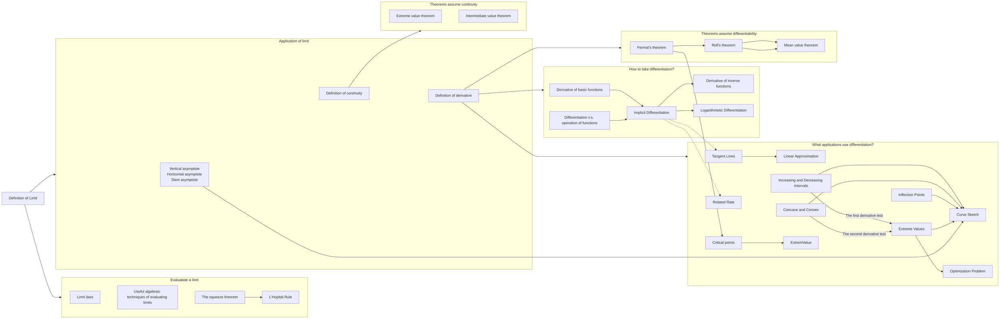

```mermaid
%%{init: {"flowchart":{"useMaxWidth": 0}}}%%
flowchart LR;
    Limit["Definition of Limit"];
    LimitLaw["Limit laws"];
    LimitTech["Useful algebraic techniques of evaluating limits"];
    Squeeze["The squeeze theorem"];
    LHopital["L'Hopital Rule"];
    Asymptote["Vertical asymptote
    Horizontal asymptote
    Slant asymptote"];
    Continuity["Definition of continuity"];
    EVT["Extreme value theorem"];
    IVT["Intermediate value theorem"];
    Diff["Definition of derivative"];
    BasicFunction["Derivative of basic functions"];
    BasicRules["Differentiation v.s. operation of functions"];
    ImplicitDiff["Implicit Differentiation"];
    DiffInverse["Derivative of inverse functions"];
    LogDiff["Logarithmetic Differentiation"];
    TangentLine["Tangent Lines"];
    LinearApprox["Linear Approximation"];
    RelatedRate["Related Rate"];
    CurveSketch["Curve Sketch"];
    CriticalPt["Critical points"];
    ExtremeValue["Extreme Values"];
    InflectionPt["Inflection Points"];
    Increasing["Increasing and Decreasing Intervals"];
    Concavity["Concave and Convex"];
    OptimizationProblem["Optimization Problem"];
    Fermat["Fermat's theorem"];
    Roll["Roll's theorem"];
    MVT["Mean value theorem"];

    subgraph LimitHow [Evaluatate a limit];
      direction LR;
      LimitLaw~~~LimitTech;
      LimitTech~~~Squeeze;
      Squeeze-->LHopital;
    end;
    Limit-->LimitHow;
    subgraph LimitApplication [Application of limit];
      direction LR;
      Asymptote~~~Continuity;
      Continuity~~~Diff;
    end;
    Limit-->LimitApplication;
    subgraph ContinuityTheorems [Theorems assume continuity];
      direction LR;
      EVT~~~IVT;
    end;
    Continuity-->ContinuityTheorems;
    subgraph DiffHow [How to take differentiation?];
      direction LR;
      BasicFunction & BasicRules-->ImplicitDiff;
      ImplicitDiff-->DiffInverse & LogDiff;
    end;
    Diff-->DiffHow;
    subgraph DiffApplication [What applications use differentiation?];
      direction LR;
      TangentLine-->LinearApprox;
      RelatedRate~~~Increasing & Concavity;
      Increasing & Concavity-->CurveSketch;
      CriticalPt-->ExtremValue;
      InflectionPt & ExtremeValue --> CurveSketch;
      Increasing-->|The first derivative test|ExtremeValue;
      Concavity-->|The second derivative test|ExtremeValue;
      ExtremeValue-->OptimizationProblem;
    end;
    Diff-->DiffApplication;
    ImplicitDiff-.->TangentLine;
    ImplicitDiff-.->RelatedRate;
    Asymptote-->CurveSketch;
    subgraph DiffTheorems [Theorems assume differentiability];
      direction LR;
      Fermat-->Roll-->MVT;
      Roll-->MVT;
    end;
    Fermat-->CriticalPt;
    Diff-->DiffTheorems;
```