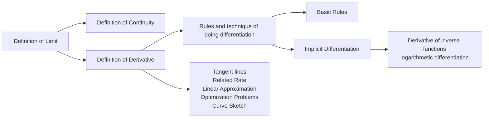

```mermaid
flowchart LR;
    Limit["Definition of Limit"];
    Continuity["Definition of Continuity"];
    Derivative["Definition of Derivative"];
    Rules["Rules and technique of doing differentiation"];
    BasicRules["Basic Rules"];
    ImplicitDifferentiation["Implicit Differentiation"];
    More["`Derivative of inverse functions
    logarithmetic differentiation`"];
    Application["`Tangent lines
    Related Rate
    Linear Approximation
    Optimization Problems
    Curve Sketch
    `"];
    Limit-->Derivative;
    Limit-->Continuity;
    Derivative-->Rules;
    Rules-->BasicRules;
    Rules-->ImplicitDifferentiation;
    ImplicitDifferentiation-->More;
    Derivative-->Application;
```  