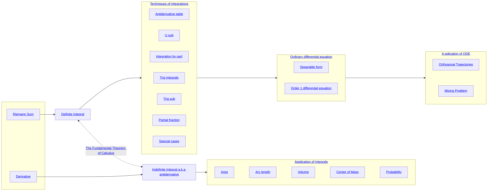

```mermaid
%%{init: {"flowchart":{"useMaxWidth": 0}}}%%
flowchart LR;
RiemannSum[<a href='../books/calculus/4-definite-and-indefinite-integral/#riemann-sum'>Riemann Sum</a>];
Derivative[<a href='#'>Derivative</a>];
DefiniteIntegral[<a href='../books/calculus/4-definite-and-indefinite-integral/#definition-of-indefinite-integral'>Definite Integral</a>];
IndefiniteIntegral[<a href='../books/calculus/4-definite-and-indefinite-integral/#definition-of-indefinite-integral-aka-antiderivatives'>Indefinite Integral a.k.a antiderivative</a>];
AntiderivativeTable[<a href='../books/calculus/5-tech-of-integration/#antiderivative-table'>Antiderivative table</a>];
USub[<a href='#'>U sub</a>];
IBP[<a href='#'>Integration by part</a>];
TrigIntegral[<a href='#'>Trig integrals</a>];
TrigSub[<a href='#'>Trig sub</a>];
PF[<a href='#'>Partial fraction</a>];
SC[<a href='#'>Special cases</a>];
Area[<a href='#'>Area</a>];
ArcLength[<a href='#'>Arc length</a>];
Volume[<a href='#'>Volume</a>];
CenterOfMass[<a href='#'>Center of Mass</a>];
Probability[<a href='#'>Probability</a>];
SeparableForm[<a href='#'>Separable form</a>];
Order1DiffEq[<a href='#'>Order 1 differentail equation</a>];
OrthTraj[<a href='#'>Orthogonal Trajectories</a>]
MixingProblem[<a href='#'>Mixing Problem</a>]
subgraph TechOfIntegration [<a href='../books/calculus/5-tech-of-integration'>Techniques of Integrations</a>];
    direction LR
    AntiderivativeTable;
    USub;
    IBP;
    TrigIntegral;
    TrigSub;
    PF;
    SC;
end;
subgraph AppOfIntegral [<a href='#'>Application of Integrals</a>];
    direction LR
    Area~~~ArcLength~~~Volume~~~CenterOfMass~~~Probability;
end;
subgraph ODE [<a href='#'>Ordinary differential equation</a>];
    direction LR
    SeparableForm
    Order1DiffEq
end;
subgraph AppOfODE [<a href='#'>A pplication of ODE</a>];
    direction TB
    OrthTraj~~~MixingProblem
end;
subgraph align[" "];
    direction LR
    Derivative;
    RiemannSum;
end;
RiemannSum-->DefiniteIntegral;
Derivative-->IndefiniteIntegral;
DefiniteIntegral<-.->|<a href='../books/calculus/4-1-the-fundamental-theorem-of-calculus/'>The Fundamental Theorem of Calculus</a>|IndefiniteIntegral;
IndefiniteIntegral-->AppOfIntegral;
DefiniteIntegral-->TechOfIntegration;
TechOfIntegration-->ODE-->AppOfODE;
```