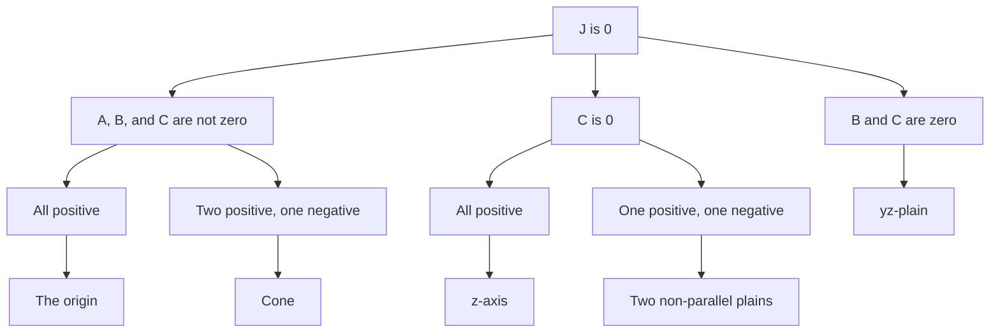

# Quadric surface


A quadric surface is the graph of a second-degree equation in three variables x,y, and z. The most general such equation is


$$
Ax^2+By^2+Cz^2+Dxy+Eyz+Fxz+Gx+Hy+Iz+J=0
$$


where $A,\ B,\ C,\ \ldots,\ J$ are constants, but by translation and rotation it can be brought into one of the two standard forms


$$
Ax^2+By^2+Cz^2+J=0\qquad\text{or}\qquad Ax^2+By^2+Cz=0.
$$


## For the form $Ax^2+By^2+Cz^2+J=0$

- The following diagram shows all possible results when we assume $J=0$.



- The following diagram shows all possible cases if we assume $J\neq 0$, and, without loss of generality, we can assume $J<0.$

	```mermaid
	graph TD
		J0["J>0"]
		N0["A, B, and C are not zero"]
		C0["C is 0"]
		B0["B and C are zero"]
		3P0N["All positive"]
		E["Ellipsoid"]
		2P1N["Two positive, one negative"]
		H1["Hyperboloid of one sheet"]
		1P2N["One positive, two negative"]
		H2["Hyperboloid of two sheets"]
		2P0N["All positive"]
		Cy["Cylinder"]
		1P1N["One positive, one negative"]
		HC["Hyperbolic cylinder"]
		1P["One positive"]
		PP["Two parallel plain"]
		J0-->N0 & C0 & B0
		N0-->3P0N & 2P1N & 1P2N
		C0-->2P0N & 1P1N
		3P0N-->E
		2P1N-->H1
		1P2N-->H2
		2P0N-->Cy
		1P1N-->HC
		B0-->1P-->PP
	
	```


## For the form $Ax^2+By^2+Cz=0$


Without loss of generality, we can assume $C>0$, and we three cases:

- $AB\neq 0$
	- $AB>0$: Elliptic paraboloid
	- $AB<0$: Hyberbolic paraboloid
- $B=0$: Parabolic cylinder

	---


# Functions of Several Variables


This semester, we will focus on the study of functions with several variables. In particular, we will examine two-variable functions $f:\Omega\subseteq\mathbb{R}^2\to \mathbb{R}$. We will also study three-variable functions. The reason being, two-variable functions and the _level surfaces_ ($f(x,y,z)=c$) of three-variable functions can be visualized.


There are two major methods to visualize a two-variable function: _cross-section_ and _contour maps_.

- To find cross-sections of a two-variable function, we can set $x=ay+b$ or $y=ax+b$ in the function. This will convert the function to a one-variable function. The cross-sections are useful for finding the range of a function.
- A contour map of a function $f(x,y)$ comprises its level curves. To create a contour map, solve the equation $f(x,y)=c$ for a specific set of numbers $c$. Nowadays, we use CAS to accomplish this task.

## Domain and Range


Finding the domain of a multivariable function is similar to that of one-variable functions. However, determining the range of multivariable functions can be more complex. Often, analyzing the range of a multivariable function is easier when examining its cross-sections.


## Relations between level curves/surface and higher dimensional function


A function with one variable $y=f(x)$ can be considered as the level curve of $F(x,y)=0$, where $F(x,y)=y-f(x)$. In the same way, a function with two variables $z=g(x,y)$ can be viewed as the level surface of $G(x,y,z)=0$, where $G=z-g(x,y)$.

