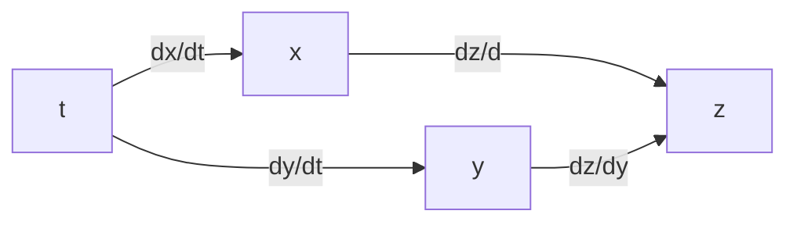

# Differentiability

In higher dimensions, we define a function $f(x_1,\ldots, x_n)$ is _differentiable_ at a point $(a_1,\ldots,a_n)$ if every partial derivative of $f$ is continuous at the point. This is slightly different from the one-dimensional case. For a real-valued function $f(x)$, being differential at $a$ means $f'(a)$ exists  

**Example.** Consider

$$
f(x,y)=\begin{cases}
\frac{xy}{x^2+y^2},\quad& (x,y)\in\mathbb{R}^2\setminus\{(0,0)\}\\\\
0,&(x,y)=(0,0).
\end{cases}
$$

We have $f(x,0) = f(0,y) = 0$, which implies that $f_x(0,0) = f_y(0,0) = 0$. However, the partial derivatives of $\frac{xy}{x^2+y^2}$ with respect to $x$ and $y$ are

$$
\frac{y^3 - x^2y}{(x^2+y^2)^2}\quad\text{and}\quad\frac{x^3 - y^2x}{(x^2+y^2)^2}
$$

respectively. Let's set $x = r\cos(\theta)$ and $y = r\sin(\theta)$. We can promptly observe that both have a pole (i.e., the limits tend to infinity) at $(0,0)$.) at $(0,0)$. The following is the graph of $z=\frac{xy}{x^2+y^2}$. We note that the graph exhibits "infinitely many wedges" near the origin, a behavior similar to $\frac{\sin(x)}{x}$ near $x=0$.

# Tangent Planes

For a surface $F(x,y,z)=0$, assume $F$ is differentiable at a point $p=(a,b,c)$. We define the _tangent plane_ at $p$ as follows:

$$
F_x(p)(x-a)+F_y(p)(y-a)+F_z(p)(z-c)=0
$$

A graph $z=f(x,y)$ can be seem as a surface $z-f(x,y)$=0, where we set $F(x,y,z)=z-f(x,y)$. Therefore, the tangent plane at a point $(a,b)$ is

$$
-f_x(a,b)(x-a)-f_y(a,b)(y-b)+(z-f(a,b))=0.
$$

To rationalize this definition, we consider an arbitrary parametrized curve $(x(t),y(t),z(t))$ on the surface passing through the point $p$. Suppose $c_1x+c_2y+c_3z=c_4$ is the tangent plane at $p$. The normal vector $(c_1,c_2,c_3)$ of the tangent plane should be perpendicular to the curve at the point $p$, i.e. $(c_1,c_2,c_3)\cdot(x'(a),y'(a),z'(a))=0.$ On the other hand, we observe that the total differentiate of $F$ at $p$ is

$$
F_x(p)dx+F_y(p)dy+F_z(p)dz=0
$$

and can be reformulated as

$$
(F_x(p),F_y(p),F_z(p))\cdot(dx,dy,dz)=0
$$

Hence, we know $(c_1,c_2,c_3)$ is parallel to $(F_x(p),F_y(p),F_z(p))$.

# Chain Rule

We can use the chain rule to efficiently compute the partial derivatives of the composition of multivariable functions. Although it's not necessary, computations become much simpler using this rule. The following diagram illustrates the basic application of the chain rule. Other versions are generalizations of this concept.

$$
\frac{\partial z}{\partial t} = \frac{\partial z}{\partial x}\frac{\partial x}{\partial t}+\frac{\partial z}{\partial y}\frac{\partial y}{\partial t}
$$

A general form of the chain rule is as follows:

$$
\frac{\partial F}{\partial t} = \sum_{i=1}^n\frac{\partial F}{\partial x_i}\frac{\partial x_i}{\partial t}.
$$

# Implicit differentiation

Given an equation $F(x,y)=0$, $F(x,y,z)=0$, or $F(x_1,\ldots,x_n)=0$, how could we find $dy/dx$, $\partial z/\partial z$, or $\partial x_i/\partial x_j$? Suppose we want to differentiate $x_n$ with respect to $x_1$ in $F(x_1,\ldots,x_n)=0$, The Implicit Function Theorem provides a condition which allows us to consider $x_n$ as a function in $x_i$s. Consequently, to find $\partial x_n/\partial x_1$, we simply use the implicit differential technique that we learned from Calculus 1 and the following fact:

$$
\frac{\partial x_1}{\partial x_1}=1\quad\text{and}\quad\frac{\partial x_i}{\partial x_1}=0
$$

for $i=2,3,\ldots,n-1$. More precisely, one has the following formulas:

## Find $\frac{dy}{dx}$ from $F(x,y)=0$

The implicit differentiation of $F(x,y)=0$ is

$$
F_x\frac{dx}{dx} + F_y\frac{dy}{dx}=0\Rightarrow Fx+F_y\frac{dy}{dx}=0.
$$

Therefore, we have

$$
\frac{dy}{dx}=-\frac{F_x}{F_y}.
$$

## Find $\frac{\partial z}{\partial x}$ from $F(z,y,z)=0$

The implicit differentiation of $F(x,y,z)=0$ is

$$
F_x\frac{\partial x}{\partial x} + F_y\frac{\partial y}{\partial x} + F_z\frac{\partial z}{\partial x}=0\Rightarrow F_x+F_z\frac{\partial z}{\partial x}=0.
$$

Therefore, we have

$$
\frac{\partial z}{\partial x} = - \frac{F_x}{F_z}.
$$

