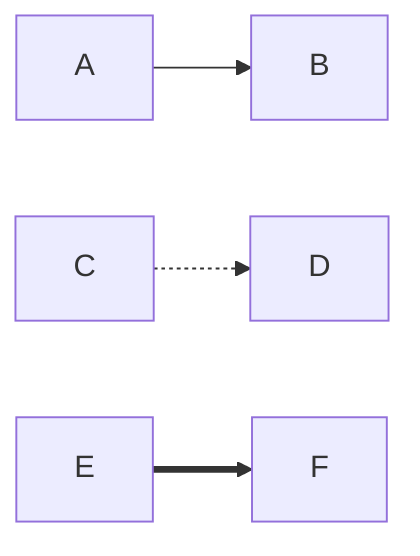
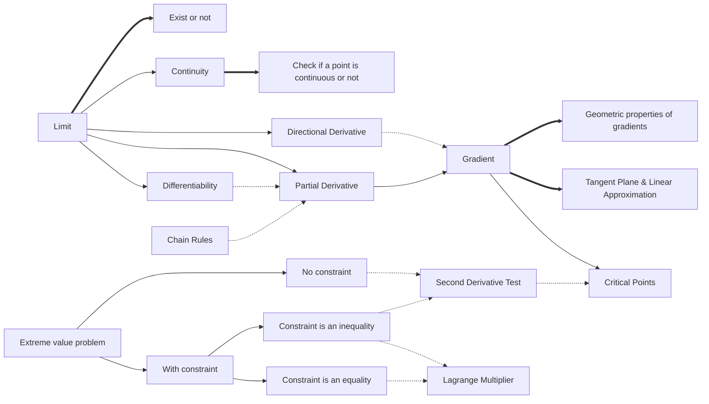
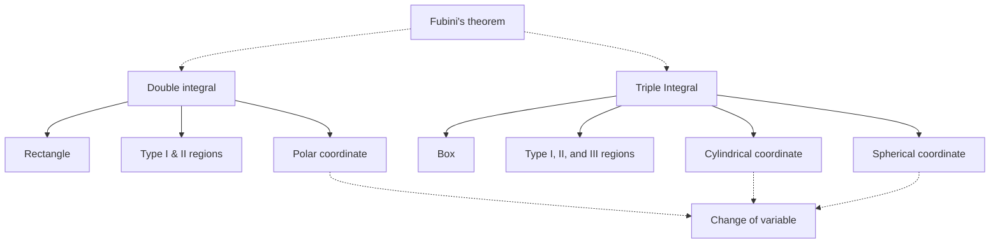

我們用實線代表定義或是分類，用虛線表示必要工具，用粗線代表直接關聯到該主題的問題。所以上面分別代表：

- A 定義了 B，或是 B 是 A 的子 sub topic
- D 是 C 的必要工具
- F 是 E 這個主題會考的題目

考試重點：

1. 極限是否存在
	1. 如果你想論證極限不存在，可以嘗試令$(x,y)=(at,bt)$或是$(x,y)=(at^n,bt^m)$，並說明極限的結果會依賴於係數$a$與$b$
	2. 如果你想論證極限存在，最簡單的題目會是你可以直接對函數在該點取值，但應該不會考，所以最好用的方法是令$x=r\sin\theta$和$y=r\cos\theta$，如果這個方法不行，請嘗試找一個好的上界去控制函數($\varepsilon-\delta$的論證)。
2. 函數連續與否，跟一維的時候一樣，只要確認函數在該點的極限是否等於該點的值。
3. 計算一次與兩次偏微分，還有透過chain rule計算一次與兩次的偏微分(重要!)
4. 偏微分可以用來幫助判斷函數在某個點是否可以微分，如果一個函數的偏微分在$p$點附近都是連續的，那麼該函數在$p$點可微分。
5. 梯度的幾何意義非常重要，它可以用來幫助我們計算方向導數以及找到通過某一個點的 level curve/surface 的切線/平面
6. 除了透過梯度來計算方向導數以外，我們也可以直接透過定義計算方向導數。
7. 梯度等於零向量的解是 critical points
8. critical points 是函數有可能出現極值的地方，需要用 second derivative test 來協助判斷
9. 極限值問題是重要的題目來源，可以大致分類成沒有條件與有條件兩種，有條件的極值問題還可以再分類成條件是等式或不等式
10. 極限值問題時常以應用題的方式出現，有可能你要自行列出函數或是限制條件。如果你對於找級值方法(the second derivative test and lagrange multipliers)沒有太大的問題，那請花一點時間確認自己有沒有閱讀障礙。

考試重點：

1. (觀念，很重要，但是很難真的出成考題) Fubini's theorem 的意義類似於 Fundamental theorem of calculus，他告訴我們什麼情況下我們可以把一個二重或三重積分用 iterated integral 來計算。
2. 高維度積分 101 ，積分的順序影響計算複雜度，選擇正確的順序，積分會相對輕鬆。
3. 如果看到 separable form 一定要用。
4. 高維度的積分的技術重點請放在如何進行 Region 的 type 的轉換上。
	1. 如果看到$x^2+y^2$(兩個變數的平方和)，那很有可能是要轉換成 polar/cylindrical coordinate。
	2. 如果看到三個變數的平方和，那很有可能是要換成 sperical coordinate
	3. 比較困難的 Region 轉換可能是類似

		$$
		\iint_{R_1}f(x,y)dV +\iint_{R_2}f(x,y)dV
		$$

		然後$R_1$跟$R_2$都沒有辦法換成其他的type來做，大這時候可以要畫一下 $R_1\cup R_2$，然後將聯集用正確的type或是變數變換的方法去處理，換句話說，上面兩個積分都做不動的時候，你應該考慮積分

		$$
		\iint_{R_1\cup R_2}f(x,y)dV
		$$

	4. 給一個變數變換$\phi(u,v)=(x(u,v),y(u,v))$，變數變換的積分關係如下：

		$$
		\iint_{\Phi(R)}f(x,y)dxdy = \iint_{\Phi(R)}f(x,y)\left|\frac{\partial(x,y)}{\partial(u,v)}\right|dudv
		$$

		如果題目有告訴你$u$或$v$的範圍($\Phi$的定義域的一個範圍)，那就直接用，例如 webwork 有一個題目說讓$R=\\{(x,y)|0\leq x\leq 7, 0\leq y\leq 8\\}$是一個 box ，然後給你一個 transformation $\Phi$ 要你對某個函數在$\Phi(R)$上面積分，這題$u$和$v$的範圍就是0到7與0到8，因為$R$是在$\Phi$的定義域，所以$R$的範圍就是我們需要的範圍。如果題目沒有告訴你$u$或$v$的範圍，那我們需要找出$\Phi^{-1}$，然後再慢慢推敲分析出正確的範圍。

