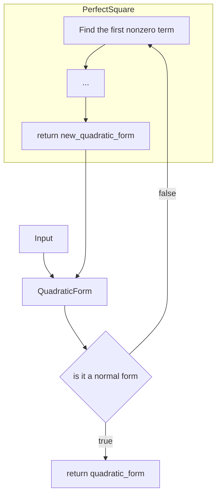
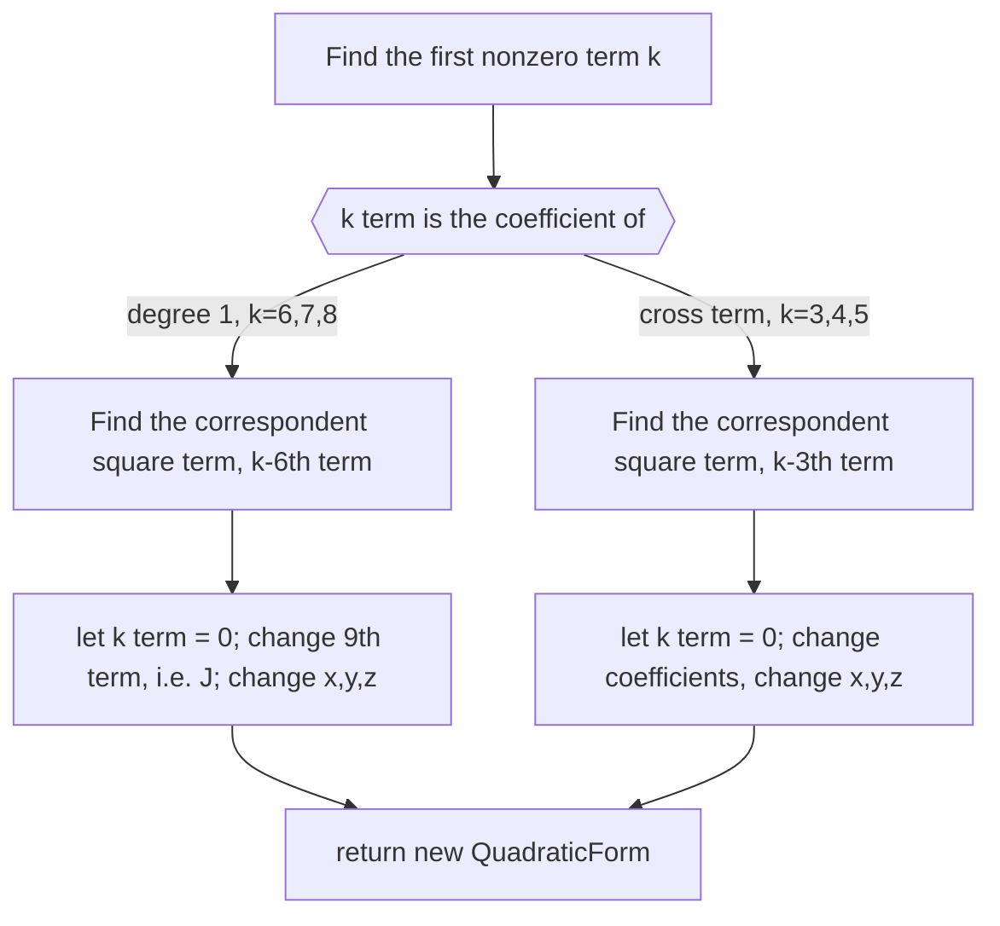

# Idea

We note that the perfect square method allows us to eliminate one term at a time. Thus, we can continuously use this method to eliminate $xy$, $yz$, $zx$, $x$, $y$, and $z$ sequentially.

# A sketch of the program

To continuously track the changes in variable and coefficient at each step, we define `QuadraticForm[[A, B, C, D, E, F, G, H, I, J], [x, y, z]]` as our datatype. In each step of our algorithm, we will apply the perfect square method to this datatype. This will consecutively reduce the values of `D`, `E`, …, and `I` to zero. Our program will be stopped when we reach a normal form.

From the aforementioned flowchart, two details are omitted:

- The method for determining if a form is in normal form;
- The actions required under `...`.

These will be explained in detail below.

# How do we determine a form is a normal form or not?

Let us observe the two normal forms $Ax^2+By^2+Cz^2+J=0$ and $Ax^2+By^2+Cz+J=0$. Let us summarize our observation:

- At most 4 nonzero terms
- No cross terms $xy$, $yz$, and $xz$.
- If the first-degree term of a variable is nonzero, then the second-degree term of the same variable has a coefficient of zero. For instance, if $z$ exists, $z^2$ does not.

# How do we use the perfect square method?

- The 0th term is A, the 1st term is B, the 2nd term is C, and so forth. Therefore, J is the 9th term.
- Changing x, y, z implies redefining these variables. For instance, if the perfect square method results in $(x+1)^2$, we then return [x+1, y ,z] as the new variables. Alternatively, if attempting to eliminate the $xz$ term yields $(x+2z)^2$, the new variables should be [x, y, x+2z].

# Testing datas?

Do I really need testing data? In fact, you don't need any testing data from me. If your program stops, for example, when we have `[[1,2,4,0,0,0,0,0,0,10],[x+2y, 2y+3z, x+2y+z]]`, you should verify whether the expansion, i.e., $(x+2y)^2+2(2y+3z)^2+4(x+2y+z)^4+10$, matches the input quadratic form or not.

