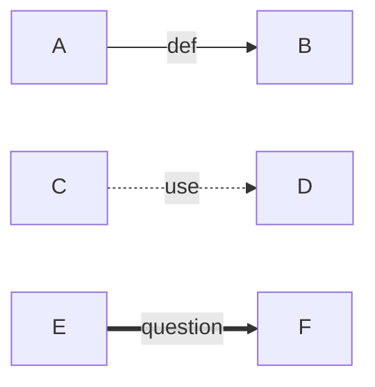
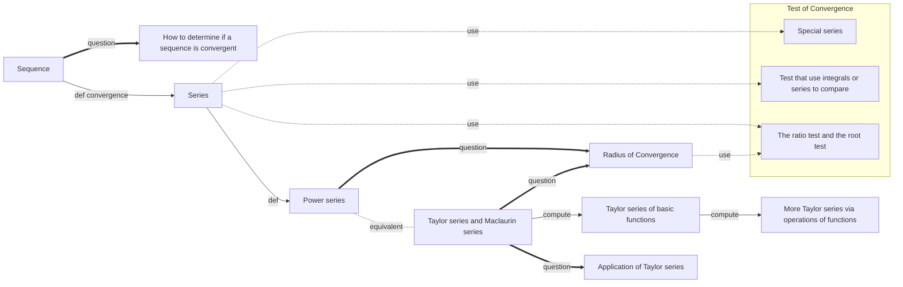

我們用實線代表定義或是分類，用虛線表示必要工具，用粗線代表直接關聯到該主題的問題。所以上面分別代表：

- A 定義了 B，或是 B 是 A 的子 sub topic
- D 是 C 的必要工具
- F 是 E 這個主題會考的題目

```mermaid
graph LR
	LISF[Define the line integral of a scalar function];
	LIVF[Define the line integral of a vector field];
	PC[Parametric curve];
	OC[Define orientation of a curve];
	CC[Define closed curve];
	POC[Define postivie orientation of a closed curve];
	subgraph Green's theorem
		direction TB
		Circulation["Circulation form"];
		Flux["Flux form"];
	end
	VF[Define vector fields];
	PF[Potential function];
	FTLI[Fundamental theorem for line integral];
	SISF[Define surface integral of a scalar function];
	SIVF[Define surface integral of a vector field];
	PS[Parametric surface];
	OS[Define orientation of a surface];
	CS[Define closed surface];
	POS[Define positive orientation of a closed surface];
	Curl[Curl];
	Stokes[Stokes' Theorem];
	Div["Div"];
	Divergence[Divergence Theorem];
	VF & LISF & OC --def---> LIVF;
	PC -- def --> OC
	CC & OC -- def --> POC;
	LIVF & POC <-. use .- Circulation & Flux;
	Circulation -. equivalent .- Flux;
	VF & SISF & OS -- def --> SIVF;
	PS -- def --> OS
	CS & OS -- def --> POS;
	SIVF <-. use .- Stokes & Divergence
	POS <-. use .- Divergence
	Circulation -. generalize .-> Stokes
	Flux -. generalize .-> Divergence
	Curl <-. use .- Stokes
	Div <-. use .- Divergence
	VF -- def --> Curl & Div
	VF ==question==> PF
	FTLI <-. use .- PF
	
	
	
```


考點：

1. 對 vector field 的線積分與曲面積分，涉及將線或面參數化。
2. 給一個 vector field，請你找到他的 potential function 然後使用 Fundamental theorem for line integral 去計算 potential function 的積分。
3. 使用 Green's theorem (有 pole 跟 no pole)
4. Stokes' theorem 的考題有
	1. 曲面積分不好算，將曲面積分換成線積分
	2. 曲面積分不好算，找一個比較好算的曲面，則原本的曲面積分等於比較好算的那個曲面的曲面積分。
5. Divergence theorem 的考題有
	1. 給出一個圓柱或多面體，其中有幾個曲面的曲面積分比較好計算，體積分也容易計算，用此來算出剩下最後一個曲面的曲面積分
	2. 給一個雙重積分等於三重積分的等式要你證明該等式。




考點：

1. 數列是否收斂。
2. 級數是否收斂
	1. 我們透過數列收斂來定義級數收斂。
	2. 注意! 只有當級數是 Geometric series 或是 Telescoping series 的時候有辦法請你計算級數收斂的值。
3. Power series 的收斂半徑，以及檢查收斂區間的 boundary point 是否也是收斂的，以此判斷是 conditional convergence 或 absolute convergence。
4. The term 'power series' is often used interchangeably with 'Taylor expansion'. However, there are subtle differences between the two. We typically refer to a power series as a 'Taylor series' when we represent a function in a closed form using a power series. It's important to note that not all power series can be represented in a closed form.
5. 算出某個函數的泰勒展開式，例如 $\int_0^{x^3}\tan(t)dt$ 或 $\sqrt{x^2+4x}$ 在 $x=-2$的泰勒展開式。
6. 泰勒展開式的收斂半徑。
7. 利用泰勒展開式的係數反推函數的n次導數的值。
8. 利用泰勒展開式去做估計，以及對該估計給出一個合理的誤差。
9. 利用泰勒展開式去計算極限 (L'Hopital rule)。
undefined