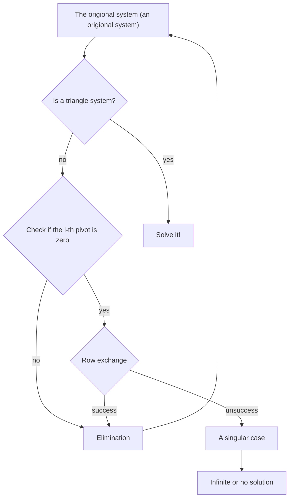

In our last class, we introduced Gaussian elimination. Today, we'll examine circumstances where this process might break down. A crucial aspect of our previous example was that every pivot was nonzero, but this isn't always true for all matrices. To illustrate how we handle these challenging situations, let's consider the following two examples.

**Example.**

$$
\left[
\begin{array}{ccc|c}
1 & 1 & 1 &2\\\\
2 & 2 & 5 &-3\\\\
4 & 6 & 8 & 1
\end{array}
\right]\xrightarrow{\substack{(2)-2\times(1)\to(2)\\\\(3)-4\times(1)\to(3)}}
\left[
\begin{array}{ccc|c}
2 & 1 & 1& 5\\\\
0 & 0& 3& -7\\\\
0 & 2& 4& -7
\end{array}
\right]
$$

We can immediately see that the second pivot is zero. Intuitively, we can swap the second and third rows without changing the solution. In other words, we obtain an equivalent system after this row exchange.

$$
\xrightarrow{(2)\leftrightarrow(3)}
\left[
\begin{array}{ccc|c}
2 & 1 &1 & 5\\\\
0 & 2 & 4 & -7\\\\
0 & 0 & 3 & -7
\end{array}
\right]
$$

**Example.**

The most challenging scenario arises when the matrix in question is singular. For example, we have

$$
\left[
\begin{array}{ccc|c}
1 & 1 & 1 & 1\\\\
2 & 2 & 2 & 1\\\\
4 & 6 & 8 & 1
\end{array}
\right]
\xrightarrow{\substack{(2)-2\times(1)\to (2)\\\\(3)-4\times(1)\to(3)}}
\left[
\begin{array}{ccc|c}
1 & 1 & 1 & 1\\\\
0 & 0 & 0 & -1\\\\
0 & 2 & 4 & -3
\end{array}
\right]
$$

Clearly, this system has no solution, even after a row exchange. When we encounter a row of the form $[0\\ 0 \\\cdots 0\\ |\\ b]$, where $b$ represents any number, we can halt the algorithm and declare the original system singular. If $b$ is zero (i.e., the row is $[0\\ 0 \\\cdots 0\\ |\\ 0]$), it indicates that the original system has infinitely many solutions. However, if $b$ is nonzero, it means the original system has no solution at all.

## A flowchart of Gaussian Elimination

**Example.** Let's consider

$$
A=\begin{bmatrix}
1 & 0\\\\
1 & 1
\end{bmatrix}
\quad\text{and}\quad
B=\begin{bmatrix}
1 & 1\\\\
0 & 1
\end{bmatrix}.
$$

It is easy to verify that $AB\neq BA$. In fact, any order of multiplication between $A$ and $B$ yeilds different result.

# English booster

  
$m\times n$

This symbol has many different ways to read it depending on the context. The most common way of reading it is "m times n" or "m multiplied by n". When this symbol is used to denote the size of a matrix, we read it as "m by n".

  

  
commutative

交換

  
