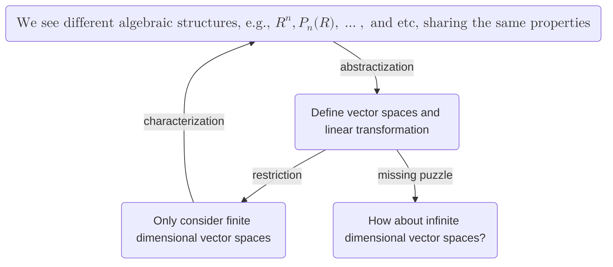

<iframe src="https://deserted-fridge-1ed.notion.site/MA2007B-Linear-Algebra-I-Lecture-Note-17-14ad3176005d8074afeecae3c98536e5" width="100%" height="300">
  
Your browser does not support iframes.

</iframe>

### Nullity-Rank Theorem

**Theorem.** Let $T:V\to W$ be a linear transformation. If $V$ is finite-dimensional, then we have

$$
\text{nullity}(T)+\text{rank}(T)=\dim(V)
$$

**proof.** Let $\dim(V)=n$. Since $V$ is finite dimensional, any subspace of $V$ is finite dimensional. Let $\kappa=\set{x_1,\ldots, x_l}$ be a basis for the kernel of $T$. By a previous lemma, we can extend $\kappa$ to a basis $\beta=\set{x_1,\ldots,x_l,y_1,\ldots,y_m}$ for $V$. We claim that $\set{T(y_1),\ldots,T(y_m)}$ forms a basis for $R(T)$.

To prove linear independence, let $0=c_1T(y_1)+\cdots+c_mT(y_m)=T(c_1y_1+\cdots+c_my_m)$. This means $c_1y_1+\cdots+c_my_m$ lies in $N(T)$. Since $N(T)\cap \text{span}\set{y_1,\ldots,y_m}=\set{0}$, we can conclude that $c_1,\ldots, c_m$ must all be zero.

To show that $\set{T(y_1),\ldots,T(y_m)}$ generates $R(T)$, let $z\in R(T)$. Then there exists $x\in V$ such that $T(x)=z$. We can write $x$ as a linear combination of $\beta$.

## Algebraic Structures Preserved by Linear Transformations

**Theorem.** Let $V$ and $W$ be vector spaces, and let $T:V\to W$ be linear. Then $T$ is one-to-one if and only if $N(T)=\set{0}$.

**proof.** From left to right, the proof is trivial. For the converse direction, let $w$ be in $W$. Suppose there exist $v_1$ and $v_2$ in $V$ such that $T(v_i)=w$ for $i=1,2$. Then $0=T(v_1)-T(v_2)=T(v_1-v_2)$. Since $v_1-v_2\in N(T)=\set{0}$, we have $v_1=v_2$. Therefore, $T$ is one-to-one.

**Theorem.** Let $\set{v_1,\ldots, v_n}\subset V$ be linearly independent. A linear transformation $T:V\to W$ is one-to-one if and only if $\set{T(v_1),\ldots,T(v_n)}$ is linearly independent.

**proof.** If $T:V\to W$ is injective, then the kernel is trivial. Let $0=c_1T(v_1)+\cdots+c_nT(v_n)$. Then $c_1v_1+\cdots+c_nv_n\in N(T)=\set0$. Since $\set{v_1,\ldots,v_n}$ is linearly independent, all $c_i$ are zero. Conversely, we claim that $N(T)=\set{0}$. Let $x\in N(T)$. We can write $x$ as $c_1v_1+\cdots+c_nv_n$. It implies $0=T(x)=T(c_1v_1+\cdots+c_nv_n)=c_1T(v_1)+\cdots+c_nT(v_n)$, so all $c_i$ are zero.

**Theorem.** Let $\set{v_1,\ldots, v_n}$ be a generating set of $V$. A linear transformation $T:V\to W$ is onto if and only if $\set{T(v_1),\ldots,T(v_n)}$ is a generating set for $W$. 

**proof.** Let $T:V\to W$ be surjective. Then, $w\in W$ is in the range of $T$, meaning there exists $v\in V$ such that $T(v)=w$. Since we can write $v$ as $c_1v_1+\cdots +c_nv_n$ for some $c_i\in F$, we have $T(v)=T(c_1v_1+\cdots+c_nv_n)=c_1T(v_1)+\cdots+c_nT(v_n)$. This proves that $\set{T(v_1),\ldots,T(v_n)}$ is a generating set for $W$. Conversely, for any $w\in W$, we can express $w$ as $c_1T(v_1)+\cdots+c_nT(v_n)$ for some $c_i\in F$. Therefore, $w$ is the image of $c_1v_1+\cdots+c_nv_n$ under $T$, proving that $T$ is onto.

**Remark.** Here's the key insight: injective transformations preserve linear independence, while surjective transformations preserve generating sets. As a result, a bijective linear transformation preserves bases.

**Theorem.** Let $V$ and $W$ be vector spaces of equal finite dimension, and let $T:V\to W$ be linear. Then $T$ is one-to-one if and only if $T$ is onto. Moreover, $T$ maps a basis for $V$ to a basis for $W$.

**proof.** By the rank-nullity theorem, if $\dim(V)=\dim(W)$, then $\text{nullity}(T)=0$ and $\text{rank}(T)=\dim(W)$ must happen simultaneously, meaning $T$ is injective if and only if $T$ is surjective. The second part of this theorem is a direct consequence of the above two theorems.

In advanced abstract algebra, we call a bijective linear transformation an _isomorphism_, and say that the linear transformation is _isomorphic_.

These theorems demonstrate that the image of a basis under a linear transformation determines all properties of that transformation. Once we assign values to a basis, the linear transformation is completely determined. We formalize this observation in the following theorem.

**Theorem.** Let $V$ and $W$ be vector spaces, and suppose that $V$ is a finite dimensional vector space with basis $\set{x_1,\ldots,x_n}$. For any subset $\set{y_1,\ldots,y_n}$ of $W$ there exists exactly one linear transformation $T:V\to W$ such that $T(x_i)=y_i$ for $i=1,\ldots, n$.

**proof.** Suppose $U(x_i)=y_i$ for $i=1,\ldots,n$. We claim $U(x)-T(x)=0$ for all $x\in V$. Let's write $x$ as $c_1x_1+\cdots+c_nx_n$ for $c_i\in F$. We then have

$$
U(x)-T(x)=U(c_1x_1+\cdots+c_nx_n)-T(c_1x_1+\cdots+c_nx_n)=0
$$

### Matrices and Linear Transformations Between Finite-Dimensional Vector Spaces

We have previously shown that any finite-dimensional vector space $V$ can be represented as a coordinate system $F^n$. Let's examine the following diagram:

Note that the vertical maps are bijective, so the composition of the vertical maps and $T$ induces a map from $\mathbb{R}^n$ to $\mathbb{R}^m$. On the other hand, we know that an $n\times m$ matrix induces a linear transformation from $\mathbb{R}^n$ to $\mathbb{R}^m$. This raises a natural question: can we represent $T$ as a matrix? In other words, we want to determine if the map (the bottom arrow) is a matrix.

Let us denote the standard basis for $\mathbb{R}^n$ by $\set{e_1,\ldots,e_n}$ and the standard basis for $\mathbb{R}^m$ by $\set{f_1,\ldots, f_m}$. Let's choose bases $\beta_V=\set{v_1,\ldots, v_n}$ and $\beta_W=\set{w_1,\ldots,w_m}$ for $V$ and $W$ respectively. By the above theorem, the linear transformation $T$ is determined by assigning values to each $T(v_i)$. Let

$$
T(v_i)=c_{1i}w_1+\cdots+c_{mi}w_m
$$

Since the vertical maps simply change $e_i$ to $v_i$ and $f_i$ to $w_i$, the bottom map $T':\mathbb{R}^n\to \mathbb{R}^m$ has

$$
T'(e_i)=c_{1i}f_1+\cdots+c_{mi}f_m.
$$

We observe that $T'$ is equivalent to matrix multiplication, where we multiply the matrix

$$
\begin{bmatrix}
c_{11} & \cdots & c_{1n}\\\\
\vdots & \ddots & \vdots\\\\
c_{m1} & \cdots & c_{mn}
\end{bmatrix}
$$

by the vector $e_i$. The matrix is called the _matrix representative_ of $T$.

We further notice that composition of linear transformations between finite-dimensional vector spaces can be interpreted as matrix multiplication. 

From our introduction of vector spaces and their axioms to our representation of linear transformations between finite-dimensional vector spaces as matrices, we have covered the fundamental groundwork of modern mathematics. The following graph illustrates this progression.

Note: The study of infinite-dimensional vector spaces marks the beginning of functional analysis.

