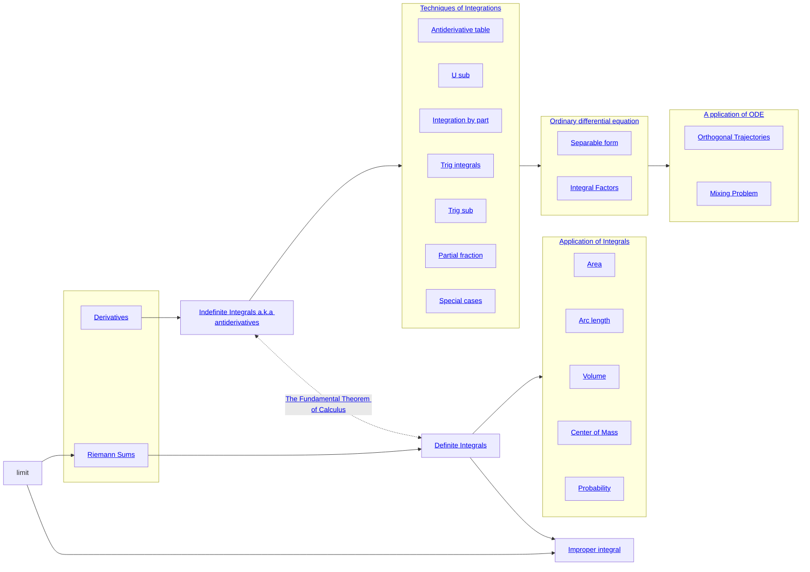

```mermaid
flowchart LR;
RiemannSum[<a href='../books/calculus/4-definite-and-indefinite-integrals/#riemann-sum'>Riemann Sums</a>];
Derivative[<a href='#'>Derivatives</a>];
Limit["limit"];
IndefiniteIntegral[<a href='../books/calculus/4-definite-and-indefinite-integrals/#definition-of-indefinite-integral-aka-antiderivatives'>Indefinite Integrals a.k.a antiderivatives</a>];
DefiniteIntegral[<a href='../books/calculus/4-definite-and-indefinite-integrals/#definition-of-indefinite-integral'>Definite Integrals</a>];
ImproperIntegral[<a href='../books/calculus/7-improper-integrals/'>Improper integral</a>];
AntiderivativeTable[<a href='../books/calculus/5-techs-of-integration/#antiderivative-table'>Antiderivative table</a>];
USub[<a href='../books/calculus/5-techs-of-integration/#the-substitution-rule'>U sub</a>];
IBP[<a href='../books/calculus/5-techs-of-integration/#integration-by-part'>Integration by part</a>];
TrigIntegral[<a href='../books/calculus/5-techs-of-integration/#trig-integrals'>Trig integrals</a>];
TrigSub[<a href='../books/calculus/5-techs-of-integration/#trigonometric-substitution'>Trig sub</a>];
PF[<a href='../books/calculus/5-techs-of-integration/#partial-fraction'>Partial fraction</a>];
SC[<a href='../books/calculus/5-techs-of-integration/#special-cases'>Special cases</a>];
Area[<a href='../books/calculus/6-1-geometric-applications-of-integration/#area'>Area</a>];
ArcLength[<a href='../books/calculus/6-1-geometric-applications-of-integration/#arc-length'>Arc length</a>];
Volume[<a href='../books/calculus/6-1-geometric-applications-of-integration/#volume-of-a-solid'>Volume</a>];
CenterOfMass[<a href='../books/calculus/6-1-geometric-applications-of-integration/#center-of-mass'>Center of Mass</a>];
Probability[<a href='../books/calculus/6-2-probability/'>Probability</a>];
SeparableForm[<a href='../books/calculus/8-1-how-to-solve-order-1-odes/#separable-form'>Separable form</a>];
Order1DiffEq[<a href='../books/calculus/8-1-how-to-solve-order-1-odes/#integral-factor-non-separable-form'>Integral Factors</a>];
OrthTraj[<a href='../books/calculus/8-2-applications-of-odes/#orthogonal-trajectories'>Orthogonal Trajectories</a>]
MixingProblem[<a href='../books/calculus/8-2-applications-of-odes/#mixing-problem'>Mixing Problem</a>]
subgraph TechOfIntegration [<a href='../books/calculus/5-tech-of-integration'>Techniques of Integrations</a>];
    direction LR;
    AntiderivativeTable;
    USub;
    IBP;
    TrigIntegral;
    TrigSub;
    PF;
    SC;
end;
subgraph AppOfIntegral [<a href='../books/calculus/6-applications-of-integration'>Application of Integrals</a>];
    direction TB;
    Area~~~ArcLength~~~Volume~~~CenterOfMass~~~Probability;
end;
subgraph ODE [<a href='../books/calculus/8-ordinary-differential-equations/'>Ordinary differential equation</a>];
    direction LR;
    SeparableForm;
    Order1DiffEq;
end;
subgraph AppOfODE [<a href='../books/calculus/8-2-applications-of-odes'>A pplication of ODE</a>];
    direction TB;
    OrthTraj~~~MixingProblem;
end;
subgraph align[" "];
    direction LR;
    Derivative;
    RiemannSum;
end;
Limit-->RiemannSum
Limit & DefiniteIntegral-->ImproperIntegral;
RiemannSum-->DefiniteIntegral;
Derivative-->IndefiniteIntegral;
IndefiniteIntegral<-.->|<a href='../books/calculus/4-1-the-fundamental-theorem-of-calculus/'>The Fundamental Theorem of Calculus</a>|DefiniteIntegral;
DefiniteIntegral-->AppOfIntegral;
IndefiniteIntegral-->TechOfIntegration;
TechOfIntegration-->ODE-->AppOfODE;
```

